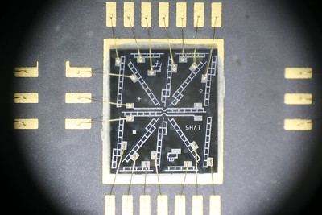

# HMDL2416 #

Small sketch for the Arduino to display characters on an HMDL2416.
This is a 16-segment LED display originally made by Hewlett Packard.
It accepts 7-bit ASCII codes on pins D0-D6.

## Connections ##

| Name | Arduino Pin | HMDL2416 Pin |
|:-----|:------------|:-------------|
| WR   | 7           | 6            |
| A0   | 8           | 8            |
| A1   | 9           | 7            |
| CS   | 10          | 1            |
| D0   | 0           | 11           |
| D1   | 1           | 12           |
| D2   | 2           | 13           |
| D3   | 3           | 14           |
| D4   | 4           | 17           |
| D5   | 5           | 16           |
| D6   | 6           | 15           |
| GND  | Gnd         | 2, 4, 10     |
| VCC  | +5V         | 3, 9, 18     |

## Photo of LEDs in HMDL2416 ##

